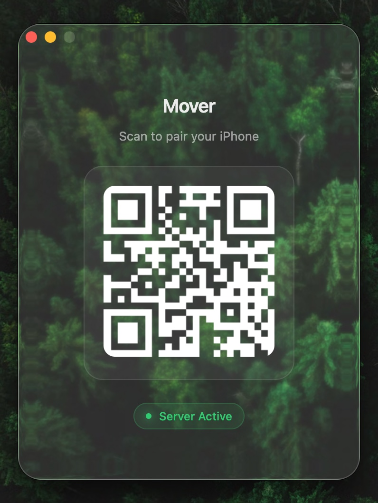

# Mover 🚀

**Mover** is a precision tethered input control that turns your iPhone into a high-performance, ultra-low latency trackpad for macOS. It features a premium "Liquid Glass" aesthetic and dynamic WebGL shaders for a tactile, responsive feel.

## 🪄 Quick Start

1. **Install**: `npm install`
2. **Launch**: `npm start`
3. **Pair**: Scan the QR code in the desktop app with your iPhone.
4. **Control**: Use your iPhone to scroll, click, and move your cursor with zero latency.

*Note: Ensure Terminal/Mover has Accessibility permissions in System Settings.*

## 🤝 Credits

- Created by **RimorCosmicam**
- Visuals powered by [Electron Liquid Glass](https://github.com/Meridius-Labs/electron-liquid-glass)
